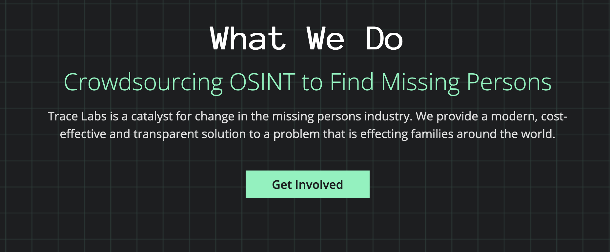

# **OSINT**
## Open Source Intelligence
##### Nikola Todorovic
---

# Introduction

* OSINT refers to the practice of collecting and analyzing **publicly available information** to gain insights and intelligence about various subjects or entities.
* Shift during the Cold War: HUMINT and SIGINT dominance
* Emergence of the Internet

---

# Who uses it

* Government
* Military
* Investigative journalists
* Human rights investigators
* Private Investigators
* Law firms
* Cyber Threat Intelligence
* Social Engineers

---

# Sources

* Public Records
* News media
* Libraries
* Images, Videos
* Websites
* Social media platforms
* The Dark web
---

# Personal usage

* Protect yourself
* Prepare for the job interview
* Prepare for presentation
* Improve your networking

---

# TraceLabs

---

# Tools

* Google fu
* Shodan
* Wayback machine (archive.org)
* Sherlock
* Yandex reverse picture search
* Maltego